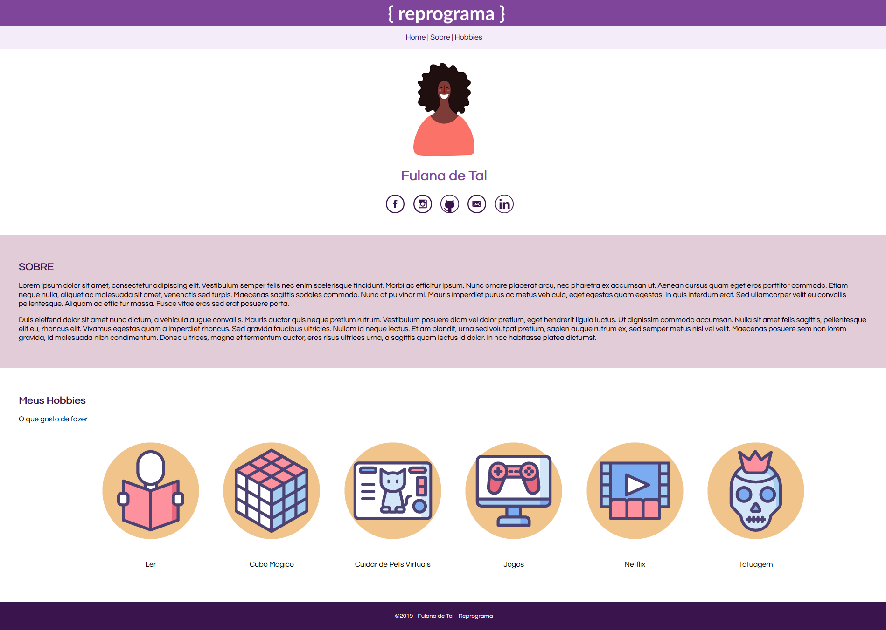

# Exercicio - Página pessoal

***

### O que devo fazer

1. No seu github crie um repositório chamado nome-do-seu-github.github.io (caso não exista)
2. Faça o clone desta pasta em sua maquina
3. Navegue pelo terminal até esta pasta
4. Verifique o status da pasta
5. Faça um pull para atualizar o conteúdo
6. Faça um clone do nosso exercicio 1 - https://github.com/mariaritacasagrande/Exercicio-de-Git-Pagina-Pessoal
7. Copie o conteúdo da pasta no diretório que criamos anteriormente em sua maquina (nome-do-seu-github.github.io)
8. Com os arquivos na pasta que criamos, preencher a página index.html com os seus dados (nome, redes sociais, hobbies e um pouquinho sobre você)
9. Escolha um avatar das imagens da pasta "imagens"
10. Escolha seus hobbies na pasta png
11. Quando seu projeto estiver concluido, usando o terminal, verifique o status das mudanças
12. Faça o Commit
13. Faça o push para o github
14. Veja o Resultado no endereço nome-do-seu-github.github.io

***

### Resultado esperado

***

