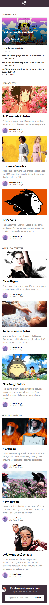
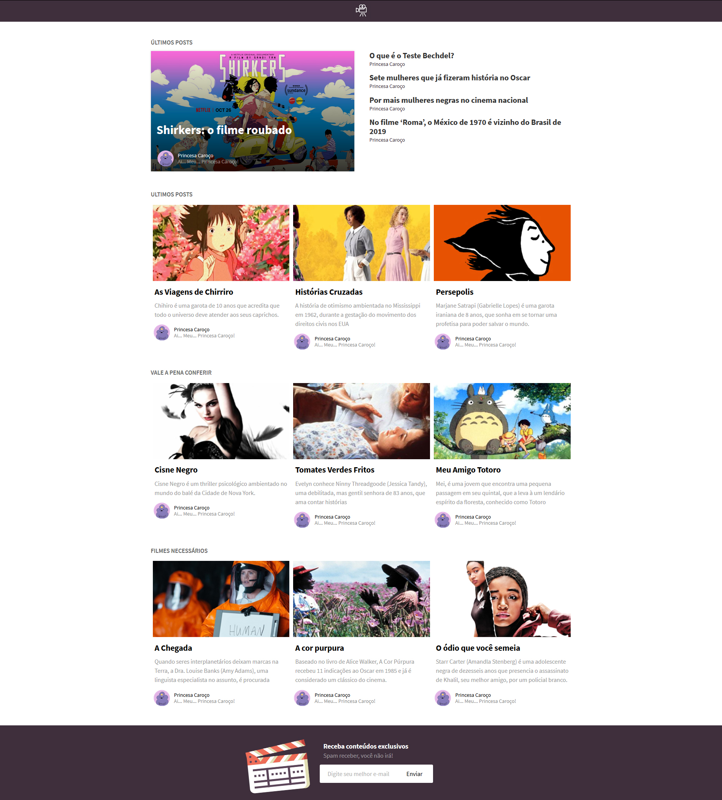
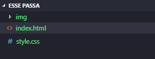
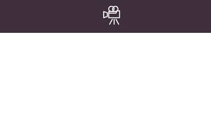
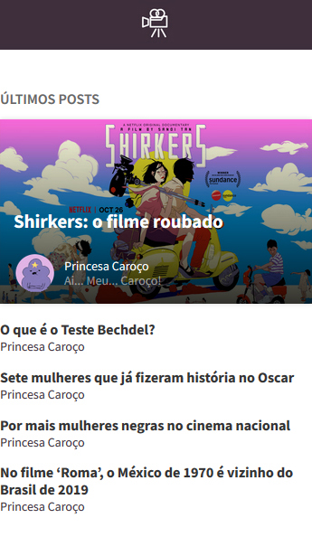
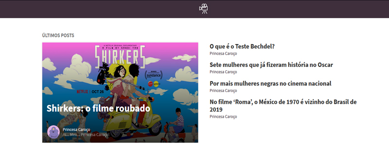
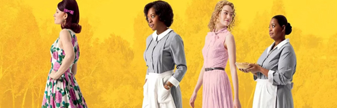
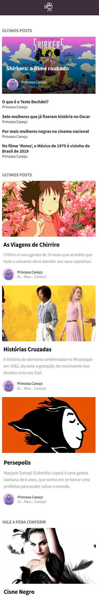
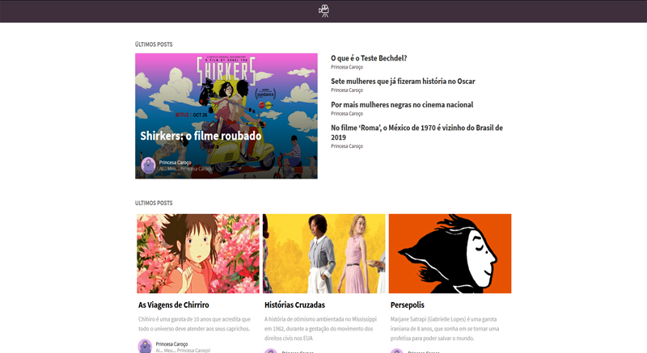
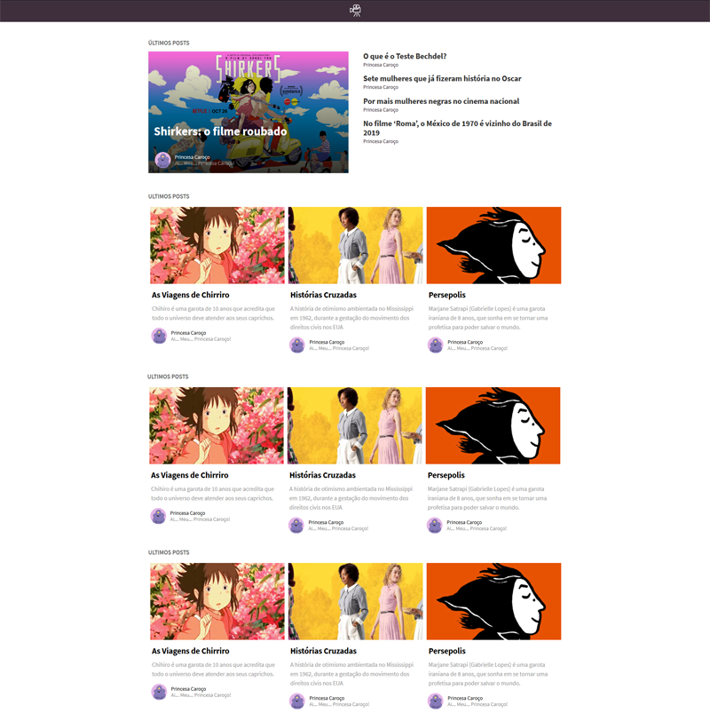

# Criando seu primeiro projeto Mobile First 
###### (exercicio de desenvolvimento acompanhado e comentado passo a passo)

A ideia Mobile First é começar a desenvolver e planejar projetos primeiro para dispositivos móveis e depois para tablets/desktops.

Este será nosso projeto:



Projeto Mobile



Projeto desktop


# Primeiro Passo

Vamos configurar a nossa estrutura de desenvolvimento , criaremos o **index.html** , **style.css** e também a pasta img o nome do nosso projeto é RocketBlog , segue abaixo o exemplo da nossa estrutura




**Referencia do site em funcionamento:**https://mariaritacasagrande.github.io/reprograma/site-esse-passa/index.html
## O Desenvolvimento

agora vamos começar configurando o <head> do nosso projeto, este código esta localizado no **index.html**

```sh
<!DOCTYPE html>
<html lang="pt_BR">

<head>
<meta charset="UTF-8">
<meta name="viewport" content="width=device-width, initial-scale=1">
<title>Esse Passa</title>
<meta name="robots" content="index, follow" />

<!-- Favicon -->
<link rel="icon" href="img/favicon.png" />

<!-- Depêndencias -->
<link rel="stylesheet" href="./style.css">
<link rel="stylesheet" href="./normalize.css">
<link href="https://fonts.googleapis.com/css?family=Source+Sans+Pro:300,400,600,700" rel="stylesheet">

</head>

<body>

</body>

</html>
```

Adicionamos o normalize.css no projeto , faça o download do normalize aqui : [http://necolas.github.io/normalize.css/]

Coloque o Favicon na pasta img.


Agora vamos criar a nossa seção **<header>**

### Header

adicione o logo na pasta **img**


Código do **header** para adicionar o **index.html**

```sh
 <!-- INICIO HEADER -->
<header>
        
      </header>
    <!-- FIM HEADER -->
```

Classe css do **header** para ser adicionado no **style.css**

```sh
* {
    box-sizing: border-box;
    font-family: "Source Sans Pro", sans-serif;
  }
  
  header {
    width: 100%;
    background: #3E2F3C;
    text-align: center;
    padding-top: 0.4rem;
    padding-bottom: 0.4rem;
  }
  
  header img {
    width: 40px;
    height: 40px;
  }
```
ao adicionar esses códigos nossa pagina esta desta maneira no mobile:




Antes de continuarmos no desenvolvimento do nosso projeto, temos que criar uma classe chamada **.container** , que é responsável por centralizar todo o conteúdo do nosso projeto.

```sh
.container {
    width: 100%;
    padding-right: 15px;
    padding-left: 15px;
    margin-right: auto;
    margin-left: auto;
  }
  
  /* BREAKPOINT 576px */
  @media (min-width: 36em) {
    .container {
      max-width: 540px;
    }
  }
  
  /* BREAKPOINT 768px */
  @media (min-width: 48em) {
    .container {
      max-width: 720px;
    }
  }
  
  /* BREAKPOINT 992px */
  @media (min-width: 62em) {
    .container {
      max-width: 960px;
    }
  }
  
  /* BREAKPOINT 1200px */
  @media (min-width: 75em) {
    .container {
      max-width: 1140px;
    }
  }
```

Criamos a classe do **.container** e também os **breakpoints** , que iremos precisar no projeto. Utilizamos as medidas em **em** porque **em** , é uma medida relativa. O valor é calculado levando sempre em consideração o **font-size** do pai. Isso quer dizer que um elemento com **font-size: 2em** vai ter o dobro do tamanho da fonte do pai, seja ele qual for.

#### Bem como eu calculo o valor em EM?

Você vai pegar o valor que você precisa por exemplo: **1200px** e dividir pelo tamanho da fonte do navegador , a maioria dos navegadores utilizam **16px** como padrão para o <html>.

Então você pega 1200 / 16 = 75em. ai temos o valor de 1200px em EM.

### Ultimos Posts

#### Imagens

adicionar as imagens na pasta **img**


adicionar este código abaixo do **header**

```sh
 <!-- INICIO MAIN -->
  <main>
        <!-- INICIO ULTIMOS POSTS -->
        <section>
          <div class='ultimos-posts'>
            <div class='container'>
              <div class='d-flex'>
    
                <h2>Últimos Posts</h2>
    
                <ul>
                  <div class="d-flex">
                    <div class="destaque">
                      <li>
                        
                        <figcaption>
                          <h3>Shirkers: o filme roubado</h3>
    
                          <div class="autor-destaque">
                            <div class="d-flex">
                              <div class="foto-autor">
                                
                              </div><!-- /foto-autor -->
    
                              <div class="sobre-autor">
                                <p>Princesa Caroço</p>
                                <span>Ai... Meu... Caroço!	</span>
                              </div><!-- /sobre-autor -->
                            </div><!-- /d-flex -->
                          </div><!-- /autor-destaque -->
    
                        </figcaption>
                        <a href="#"></a>
                      </li>
                    </div><!-- /destaque -->
    
                    <div class="sub-itens">
                      <li>
                        <a href="#">
                          <p>O que é o Teste Bechdel?</p>
                          <span>Princesa Caroço</span>
                        </a>
                      </li>
    
                      <li>
                        <a href="#">
                          <p>Sete mulheres que já fizeram história no Oscar</p>
                          <span>Princesa Caroço</span>
                        </a>
                      </li>
    
                      <li>
                        <a href="#">
                          <p>Por mais mulheres negras no cinema nacional</p>
                          <span>Princesa Caroço</span>
                        </a>
                      </li>
    
                      <li>
                        <a href="#">
                          <p>No filme ‘Roma’, o México de 1970 é vizinho do Brasil de 2019</p>
                          <span>Princesa Caroço</span>
                        </a>
                      </li>
                    </div><!-- /sub-itens -->
                  </div><!-- /d-flex -->
                </ul>
    
              </div><!-- /d-flex -->
            </div><!-- /container -->
          </div><!-- /ultimos-posts -->
        </section>
        <!-- FIM ULTIMOS POSTS -->
        
        </main>
    <!-- FIM MAIN -->
```


Classe css de Ultimos Posts , adicionar no **style.css**

```sh
  /* MAIN */

main {
    width: 100%;
    margin-top: 2rem;
  }
  
  .d-flex {
    display: flex;
    flex-wrap: wrap;
  }
  
  h2 {
    color: #666666;
    text-transform: uppercase;
    font-size: 1em;
    font-weight: 600;
  }
  
  .ultimos-posts {
    width: 100%;
  }
  
  .ultimos-posts ul {
    width: 100%;
    list-style-type: none;
    margin: 0;
    padding: 0;
  }
  
  .ultimos-posts li {
    width: 100%;
    display: block;
    margin-bottom: 1rem;
  }
  
  .ultimos-posts li a {
    text-decoration: none;
  }
  
  .ultimos-posts li p {
    color: #333333;
    font-weight: bold;
    margin: 0;
    padding: 0;
  }
  
  .ultimos-posts li p:hover {
    color: #3E2F3C;
  }
  
  .ultimos-posts li span {
    color: #3E2F3C;
    font-size: 0.875em;
    margin: 0;
    padding: 0;
  }
  
  .destaque {
    width: 100%;
  }
  
  .destaque li {
    width: 100%;
    position: relative;
    display: inline-block;
    overflow: hidden;
    min-width: 250px;
    width: 100%;
    background-color: #000000;
    color: #ffffff;
    text-align: left;
    font-size: 16px;
    box-shadow: 0 0 5px rgba(0, 0, 0, 0.15);
  }
  
  .destaque li * {
    -webkit-transition: all 0.35s;
    transition: all 0.35s;
    -webkit-box-sizing: border-box;
    box-sizing: border-box;
  }
  
  .destaque li img.bg {
    max-width: 100%;
    vertical-align: top;
  }
  
  .destaque li:hover img.bg {
    -webkit-transform: scale(1.3) rotate(5deg);
    transform: scale(1.3) rotate(5deg);
  }
  
  .destaque li:hover figcaption h3 {
    opacity: 0.9;
    text-shadow: 0px 2px 8px rgba(0, 0, 0, 0.4);
  }
  
  .destaque li a {
    position: absolute;
    top: 0;
    bottom: 0;
    left: 0;
    right: 0;
  }
  
  .destaque li figcaption {
    position: absolute;
    top: 0;
    bottom: 0;
    left: 0;
    right: 0;
    padding: 0px 15px 10px 15px;
    background-image: -webkit-linear-gradient(
      bottom,
      rgba(0, 0, 0, 0.8) 0%,
      transparent 100%
    );
    background-image: linear-gradient(
      to top,
      rgba(0, 0, 0, 0.8) 0%,
      transparent 100%
    );
    display: flex;
    flex-direction: column;
    justify-content: flex-end;
  }
  
  .destaque li figcaption h3 {
    color: #fff;
    font-size: 1.3em;
  }
  
  .autor-destaque {
    width: 100%;
  }
  
  .autor-destaque .foto-autor {
    width: 48px;
    display: flex;
    align-items: center;
  }
  
  .autor-destaque .foto-autor img {
    max-width: 100%;
  }
  
  .autor-destaque .sobre-autor {
    width: 60%;
    display: flex;
    justify-content: center;
    flex-direction: column;
  }
  
  .autor-destaque .sobre-autor p {
    color: #fff;
    font-size: 0.875em;
    font-weight: 500;
    padding: 0;
    display: block;
    margin-left: 8px;
    margin-bottom: 0 !important;
  }
  
  .autor-destaque .sobre-autor p:hover {
    color: #fff;
  }
  
  .autor-destaque .sobre-autor span {
    font-size: 0.875em;
    display: block;
    font-weight: 500;
    color: #fff;
    opacity: 0.5;
    margin-left: 8px;
  }
```
Após adicionar os códigos é para o nosso projeto estar da seguinte forma:




### Agora vamos aos Breakpoints

Nossos breakpoints ficaram da seguinte forma:

```sh
/* BREAKPOINT 576px */
@media (min-width: 36em) {
    .container {
      max-width: 540px;
    }
  
    .destaque li figcaption h3 {
      color: #fff;
      font-size: 2em;
    }
  }
  
  /* BREAKPOINT 768px */
  @media (min-width: 48em) {
    .container {
      max-width: 720px;
    }
  
    .destaque {
      width: calc(60% - 5px);
      margin-right: 5px;
    }
  
    .sub-itens {
      width: calc(40% - 5px);
      margin-left: 5px;
    }
  }
  
  /* BREAKPOINT 992px */
  @media (min-width: 62em) {
    .container {
      max-width: 960px;
    }
  
    .destaque {
      width: calc(60% - 10px);
      margin-right: 10px;
    }
  
    .sub-itens {
      width: calc(40% - 10px);
      margin-left: 10px;
    }
  
    .ultimos-posts li p {
      font-size: 1.3em;
    }
  }
  
  /* BREAKPOINT 1200px */
  @media (min-width: 75em) {
    .container {
      max-width: 1140px;
    }
  
    .destaque {
      width: calc(50% - 20px);
      margin-right: 20px;
    }
  
    .sub-itens {
      width: calc(50% - 20px);
      margin-left: 20px;
    }
  }
```
Ao adicionar os **breakpoints** nosso projeto ficou da seguinte forma:




#### Posts Categoria

agora vamos criar a seção de post’s por categorias.

##### Imagens





Adicionar o código abaixo , abaixo de últimos posts

```sh
<!-- INICIO POST CATEGORIA -->
    <section>
            <div class='post-categoria'>
              <div class='container'>
                <h2>Ultimos Posts</h2>
      
                <div class="d-flex">
      
                  <div class="item-post">
                    <a href="javascript:void(0)">
                      <div class="item-post_foto">
                        
                      </div><!-- /item-post_foto -->
                      <p class="titulo">As Viagens de Chirriro</p>
                      <p class="resumo">
                            Chihiro é uma garota de 10 anos que acredita que todo o universo deve atender aos seus caprichos.
                      </p>
                      <div class="autor">
                        <div class="d-flex">
                          <div class="foto-autor">
                            
                          </div><!-- /foto-autor -->
      
                          <div class="sobre-autor">
                            <p>Princesa Caroço</p>
                            <span>Ai... Meu... Caroço!	</span>
                          </div><!-- /sobre-autor -->
                        </div><!-- /d-flex -->
                      </div><!-- /autor -->
                    </a>
                  </div><!-- /item-post -->
      
                  <div class="item-post">
                    <a href="javascript:void(0)">
                      <div class="item-post_foto">
                        
                      </div><!-- /item-post_foto -->
                      <p class="titulo">Histórias Cruzadas</p>
                      <p class="resumo">
                        A história de otimismo ambientada no Mississippi em 1962, durante a gestação do movimento dos direitos civis nos EUA
                      </p>
                      <div class="autor">
                        <div class="d-flex">
                          <div class="foto-autor">
                            
                          </div><!-- /foto-autor -->
      
                          <div class="sobre-autor">
                            <p>Princesa Caroço</p>
                            <span>Ai... Meu... Caroço!	</span>
                          </div><!-- /sobre-autor -->
                        </div><!-- /d-flex -->
                      </div><!-- /autor -->
                    </a>
                  </div><!-- /item-post -->
      
                  <div class="item-post">
                    <a href="javascript:void(0)">
                      <div class="item-post_foto">
                        
                      </div><!-- /item-post_foto -->
                      <p class="titulo">Persepolis</p>
                      <p class="resumo">
                            Marjane Satrapi (Gabrielle Lopes) é uma garota iraniana de 8 anos, que sonha em se tornar uma profetisa para poder salvar o mundo.
                      </p>
                      <div class="autor">
                        <div class="d-flex">
                          <div class="foto-autor">
                            
                          </div><!-- /foto-autor -->
      
                          <div class="sobre-autor">
                            <p>Princesa Caroço</p>
                            <span>Ai... Meu... Caroço!	</span>
                          </div><!-- /sobre-autor -->
                        </div><!-- /d-flex -->
                      </div><!-- /autor -->
                    </a>
                  </div><!-- /item-post -->
      
                </div><!-- /d-flex -->
              </div><!-- /container -->
            </div><!-- /post-categoria -->
          </section>
          <!-- FIM POST CATEGORIA -->

```

#### Estilo do Post Categoria


```sh
.post-categoria {
    width: 100%;
    margin-top: 2rem;
    margin-bottom: 2rem;
  }
  
  .post-categoria .item-post {
    width: 100%;
    margin-bottom: 1rem;
  }
  
  .post-categoria .item-post * {
    -webkit-transition: all 0.35s;
    transition: all 0.35s;
    -webkit-box-sizing: border-box;
    box-sizing: border-box;
  }
  
  .post-categoria .item-post:hover p.titulo {
    color: #3E2F3C;
  }
  
  .post-categoria .item-post:hover .item-post_foto img {
    opacity: 0.5;
  }
  
  .post-categoria .item-post a {
    text-decoration: none;
  }
  
  .post-categoria .item-post .item-post_foto {
    position: relative;
    width: 100%;
    height: 200px;
    overflow: hidden;
    margin-bottom: 1rem;
  }
  
  .post-categoria .item-post .item-post_foto img {
    position: absolute;
    left: 50%;
    top: 50%;
    height: 100%;
    width: auto;
    -webkit-transform: translate(-50%, -50%);
    -ms-transform: translate(-50%, -50%);
    transform: translate(-50%, -50%);
  }
  
  .post-categoria .item-post p {
    margin: 0;
    padding: 0 5px;
  }
  
  .post-categoria .item-post p.titulo {
    color: #000;
    font-weight: bold;
    font-size: 1.35em;
    margin-bottom: 0.7rem;
  }
  
  .post-categoria .item-post p.resumo {
    color: #999999;
    font-size: 1em;
    margin-bottom: 0.7rem;
    line-height: 24px;
  }
  
  .autor {
    width: 100%;
  }
  
  .autor .foto-autor {
    width: 48px;
    display: flex;
    align-items: center;
  }
  
  .autor .foto-autor img {
    max-width: 100%;
  }
  
  .autor .sobre-autor {
    width: 60%;
    display: flex;
    justify-content: center;
    flex-direction: column;
  }
  
  .autor .sobre-autor p {
    color: #000;
    font-size: 0.875em;
    font-weight: 500;
    padding: 0;
    display: block;
    margin-left: 8px;
    margin-bottom: 0 !important;
  }
  
  .autor .sobre-autor p:hover {
    color: #000;
  }
  
  .autor .sobre-autor span {
    font-size: 0.875em;
    display: block;
    font-weight: 500;
    color: #000;
    opacity: 0.5;
    margin-left: 8px;
  }
```

Ao adicionar este código e o estilo , o nosso projeto fica da seguinte maneira:




### Breakpoints

```sh
/* BREAKPOINT 576px */
@media (min-width: 36em) {
    .container {
      max-width: 540px;
    }
  
    .destaque li figcaption h3 {
      color: #fff;
      font-size: 2em;
    }
  }
  
  /* BREAKPOINT 768px */
  @media (min-width: 48em) {
    .container {
      max-width: 720px;
    }
  
    .destaque {
      width: calc(60% - 5px);
      margin-right: 5px;
    }
  
    .sub-itens {
      width: calc(40% - 5px);
      margin-left: 5px;
    }
  
    .post-categoria .item-post {
      width: calc(50% - 10px);
      margin: 5px 5px 1rem 5px;
    }
  }
  
  /* BREAKPOINT 992px */
  @media (min-width: 62em) {
    .container {
      max-width: 960px;
    }
  
    .destaque {
      width: calc(60% - 10px);
      margin-right: 10px;
    }
  
    .sub-itens {
      width: calc(40% - 10px);
      margin-left: 10px;
    }
  
    .ultimos-posts li p {
      font-size: 1.3em;
    }
  
    .post-categoria .item-post {
      width: calc(33.33% - 10px);
      margin: 5px 5px 1rem 5px;
    }
  }
  
  /* BREAKPOINT 1200px */
  @media (min-width: 75em) {
    .container {
      max-width: 1140px;
    }
  
    .destaque {
      width: calc(50% - 20px);
      margin-right: 20px;
    }
  
    .sub-itens {
      width: calc(50% - 20px);
      margin-left: 20px;
    }
  }
```
Ao adicionar o Breakpoint nosso projeto fica da seguinte maneira:



  

agora em seu arquivo html copie a seção **post categoria** duas vezes , o código vai ficar assim:



Salve as imagens abaixo na sua pasta **img** e substitua as imagens repetidas por estas, com os respectivos nomes dos filmes.


#### Newsletter

######Imagens

Salve a imagem da claquete para nossa newsletter na pasta **img**.


Adicione o código abaixo do último posts


```sh
<!-- INICIO NEWSLETTER -->
   <section>
        <div class='newsletter'>
          <div class='container'>
            <div class="d-flex">
  
              <div class="newsletter_claquete">
                
              </div><!-- /newsletter_claquete -->
  
              <div class="newsletter_conteudo">
                <div>
                  <div class="newsletter_titulo">
                    <p>Receba conteúdos exclusivos</p>
                    <span>Você não recebera spam!</span>
                  </div><!-- /newsletter_titulo -->
  
                  <div class="newsletter_input">
                    <input type="text" placeholder="Digite seu melhor e-mail" value="">
                    <button type="submit"></button>
                  </div><!-- /newsletter_input -->
                </div>
              </div><!-- /newsletter_conteudo -->
  
            </div><!-- /d-flex -->
          </div><!-- /container -->
        </div><!-- /newsletter -->
      </section>
      <!-- FIM NEWSLETTER -->
```

###### Código Css:

```sh
.newsletter {
    background: #3E2F3C;
    color: #fff;
    padding-top: 1rem;
    margin-left: 15px;
    margin-right: 15px;
    border-radius: 5px;
    margin-bottom: 1rem;
  
    overflow: hidden;
    position: relative;
  }
  
  .newsletter_claquete {
    width: 100%;
    position: absolute;
    left: -16px;
    top: 12px;
    text-align: left;
    z-index: 0;
  }
  
  .newsletter_claquete img {
    width: 47px;
  }
  
  .newsletter_conteudo {
    width: 100%;
    text-align: center;
  }
  
  .newsletter_titulo {
    width: 95%;
    padding: 0;
    margin-left: 10px;
    position: relative;
    z-index: 1;
  }
  
  .newsletter_titulo p {
    margin: 0;
    padding: 0;
    font-weight: 800;
    font-size: 1.1em;
    margin-bottom: 0.3rem;
  }
  
  .newsletter_titulo span {
    opacity: 0.5;
    margin-bottom: 0.3rem;
  }
  
  .newsletter_input {
    width: 100%;
    max-width: 300px;
    margin: 0 auto;
    background: #fff;
    height: 48px;
    display: flex;
    -webkit-box-align: center;
    align-items: center;
    margin-top: 15px;
    background: rgb(255, 255, 255);
    border-radius: 3px;
    padding: 0px 20px;
    margin-bottom: 1rem;
  }
  
  .newsletter_input input {
    font-size: 16px;
    color: rgb(102, 102, 102);
    flex: 1 1 0%;
    border-width: 0px;
    border-style: initial;
    border-color: initial;
    border-image: initial;
    outline: 0;
  }
  
  .newsletter_input button {
    background: transparent;
    border: 0;
    cursor: pointer;
  }
```

Ao Adicionar os código nosso projeto esta assim:


### Breakpoints

```sh
 /* BREAKPOINT 768px */
@media (min-width: 48em) {
     
    .newsletter {
      margin-left: 0;
      margin-right: 0;
      border-radius: 0;
      margin-bottom: 0rem;
    }
  
    .newsletter_claquete {
      width: calc(40% - 20px);
      margin-right: 20px;
      position: relative;
      left: auto;
      top: auto;
      text-align: right;
      z-index: 0;
    }
  
    .newsletter_claquete img {
      width: auto;
      max-width: 100%;
      margin-bottom: -5px;
    }
  
    .newsletter_conteudo {
      width: 40%;
      text-align: left;
      display: flex;
      align-items: center;
      flex-wrap: wrap;
    }
  }
```

### Projeto Final


# Você criou seu primeiro projeto mobile First!!!!!


